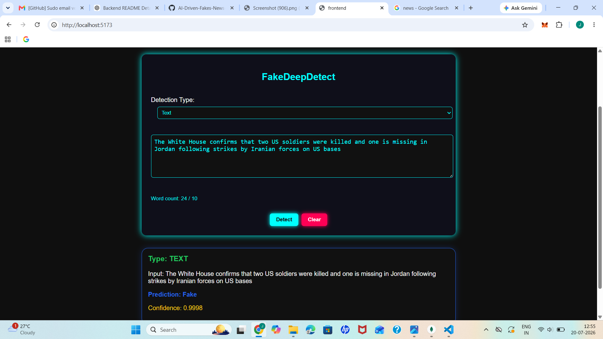
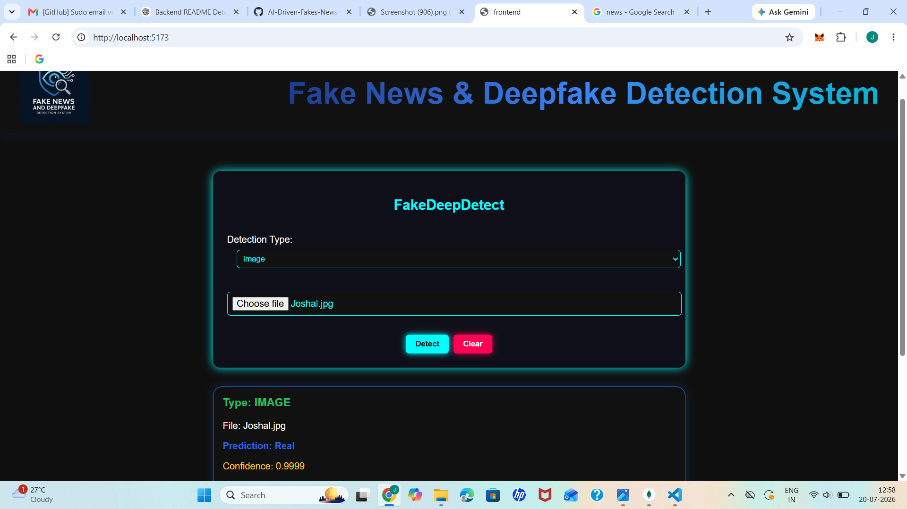

# AI-Driven Fake News and Deepfake Detection – Frontend

## Overview

This repository contains the **frontend** of the **AI-Driven Fake News and Deepfake Detection System**.

The application provides a user-friendly interface for detecting **fake news, deepfake images, and deepfake videos**. Users can provide text or upload media files, which are sent to the backend AI models for analysis. The prediction results are then displayed through the frontend interface.

The backend and AI/ML model implementation are maintained in a **separate GitHub repository**.

## Key Features

- Fake news text analysis interface
- Deepfake image upload and detection
- Deepfake video upload and detection
- Display of AI-generated prediction results
- Reusable React components
- Integration with backend detection APIs
- Clean and responsive user interface
- Support for text, image, and video inputs

## Technologies Used

- **React.js** – Used to build the frontend user interface using reusable components
- **JavaScript (JSX)** – Used for frontend logic and component development
- **Vite** – Used as the frontend development and build tool
- **HTML5** – Used for structuring the web application
- **CSS3** – Used for styling and responsive interface design
- **REST API** – Used for communication with the AI detection backend
- **Git & GitHub** – Used for version control and source code management

## Project Structure

```text
frontend/
│
├── public/
│   └── logo.png
│
├── src/
│   ├── assets/
│   │   └── logo.png
│   │
│   ├── components/
│   │   ├── DetectionForm.jsx
│   │   ├── Footer.jsx
│   │   ├── Header.jsx
│   │   └── ResultCard.jsx
│   │
│   ├── styles/
│   │   └── globals.css
│   │
│   ├── App.jsx
│   └── main.jsx
│
├── .gitignore
├── eslint.config.js
├── index.html
├── package.json
├── package-lock.json
├── README.md
└── vite.config.js
```

## Main Components

### DetectionForm

The `DetectionForm` component allows users to provide input for detection. Depending on the detection type, users can enter text or upload image/video files for analysis.

### ResultCard

The `ResultCard` component displays the prediction result returned by the backend AI detection system.

### Header

The `Header` component provides the main header section of the application.

### Footer

The `Footer` component provides the footer section of the application.

## Application Workflow

1. The user opens the AI-Driven Fake News and Deepfake Detection application.
2. The user selects or provides the required input.
3. For fake news detection, textual content is submitted for analysis.
4. For deepfake detection, an image or video is uploaded.
5. The frontend sends the input to the appropriate backend API.
6. The backend preprocesses the input and performs AI/ML model inference.
7. The prediction result is returned to the frontend.
8. The frontend displays the detection result to the user.

## Installation and Setup

### 1. Clone the Repository

```bash
git clone <your-frontend-repository-url>
```

### 2. Navigate to the Project Folder

```bash
cd AI-Driven-Fakes-News-Detector-Frontend
```

### 3. Install Dependencies

Make sure Node.js and npm are installed, then run:

```bash
npm install
```

### 4. Start the Development Server

```bash
npm run dev
```

Vite will display a local development URL, typically:

```text
http://localhost:5173
```

Open the displayed URL in your web browser.

## Backend Integration

This frontend communicates with the AI detection backend through REST APIs.

The backend handles:

- Fake news text classification
- Deepfake image detection
- Deepfake video detection
- Input preprocessing
- AI/ML model inference
- Prediction result generation

Make sure the backend server is running before testing detection functionality.

The backend will typically run at:

```text
http://127.0.0.1:8000
```

The API URL configured in the frontend must match the address and port used by the backend.

## Application Screenshots


### Fake News Detection


### Fake News Detection Result



### Deepfake Image Detection


### Deepfake Image Detection Result



### Deepfake Video Detection


### Deepfake Video Detection Result


## Purpose of the Project

The purpose of this project is to provide an accessible web-based interface for an AI-powered system capable of identifying potentially misleading or manipulated digital content.

The application combines three major detection capabilities:

- Fake news detection using Natural Language Processing
- Deepfake image detection using deep learning
- Deepfake video detection using computer vision and deep learning

The frontend provides a common interface through which users can interact with these AI detection models.

## Future Enhancements

- Improve the overall UI/UX
- Add drag-and-drop file uploading
- Display prediction confidence scores visually
- Add loading indicators during AI analysis
- Add detailed explanations for prediction results
- Support URL-based news analysis
- Add detection history
- Improve mobile responsiveness
- Deploy the frontend and backend online

## Note

The AI models and backend implementation are not included in this frontend repository. They are maintained separately in the backend repository.

Large datasets and trained model files are excluded from GitHub because of their file size.

## Author

**Joshal Fernandes**

Computer Science and Engineering  
IoT with Cybersecurity and Blockchain Technology
